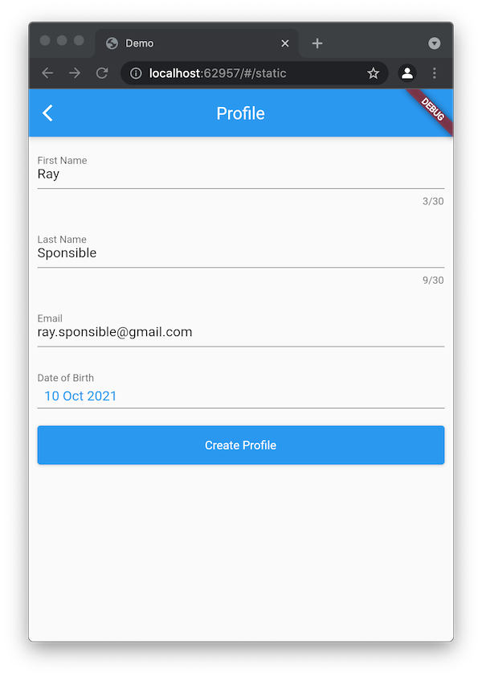
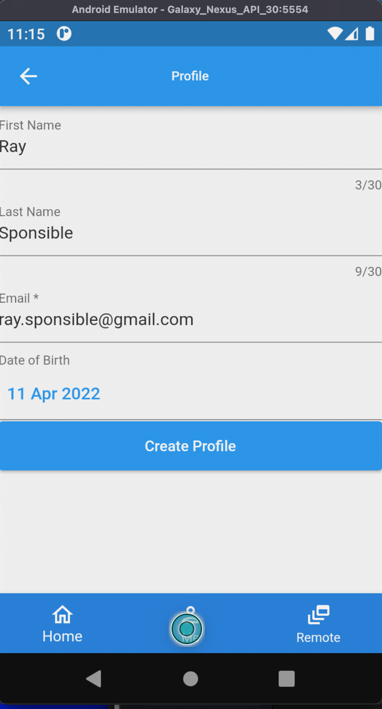
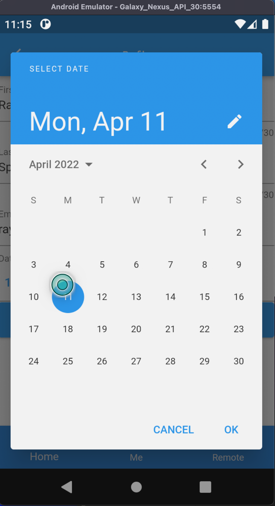

[](https://github.com/wutsi/sdui/actions/workflows/master.yml)


[](https://pub.dev/packages/sdui)

# SDUI

*SDUI* make it easy to implement Server Driven UI pattern on flutter.
- The server decides what to render by describing in a JSON the widgets to render.
- The Flutter screen parse the JSON and build the widgets

Kind like HTML... but not really.

## Example

### The Server
Here is an example of JSON returned by the URL `POST http://myapp.herokuapp.com/screens/profile`:
```json
{
  "type": "Screen",
  "appBar": {
    "type": "AppBar",
    "attributes": {
      "title": "Profile"
    }
  },
  "child": {
    "type": "Form",
    "attributes": {
      "padding": 10
    },
    "children": [
      {
        "type": "Input",
        "attributes": {
          "name": "first_name",
          "value": "Ray",
          "caption": "First Name",
          "maxLength": 30
        }
      },
      {
        "type": "Input",
        "attributes": {
          "name": "last_name",
          "value": "Sponsible",
          "caption": "Last Name",
          "maxLength": 30
        }
      },
      {
        "type": "Input",
        "attributes": {
          "name": "email",
          "value": "ray.sponsible@gmail.com",
          "caption": "Email *",
          "required": true
        }
      },
      {
        "type": "Input",
        "attributes": {
          "type": "date",
          "name": "birth_date",
          "caption": "Date of Birth"
        }
      },
      {
        "type": "Input",
        "attributes": {
          "type": "Submit",
          "name": "submit",
          "caption": "Create Profile"
        },
        "action": {
          "type": "Command",
          "url": "http://myapp.herokuapp.com/commands/save-profile",
          "prompt": {
            "type": "Confirm",
            "title": "Confirmation",
            "message": "Are you sure you want to change your profile?"
          }
        }
      }
    ]
  }
}
```

### The UI in Flutter
```dart
import 'package:flutter/material.dart';
import 'package:sdui/sdui.dart';

void main() async {
  runApp(const MyApp());
}

class MyApp extends StatelessWidget {
  const MyApp({Key? key}) : super(key: key);

  @override
  Widget build(BuildContext context) {
    return MaterialApp(title: 'Demo', initialRoute: '/', routes: _routes());
  }

  Map<String, WidgetBuilder> _routes() => {
        '/': (context) => const DynamicRoute(
            provider: HttpRouteContentProvider(
                'http://myapp.herokuapp.com/screens/profile'))
      };
}
```

### Screenshots
| Screen | Date Picker  | Alert Dialog |
|--------|--------------|--------------|
|||

## Widgets
In Flutter, UI is composed of a hierarchy of Widgets.
A widget is a visual element on a screen.

*SDUI* described widgets with the following json structure:
```
{
    "type": "...",
    "attributes": {
      "padding": 12,
      "color": "#ff0000",
      ...
    },
    "children": [
      ...
    ]
}
```

- `type`: indicates the type of widget
- `attributes`: key/value pair of the attributes of the widget. Ex: `caption`, `color`, `padding`, `spacing` etc.
- `children`: The list of children widgets

### Widget Library
- Navigation widgets
    - [Dialog](https://pub.dev/documentation/sdui/latest/sdui/SDUIDialog-class.html)
    - [AppBar](https://pub.dev/documentation/sdui/latest/sdui/SDUIAppBar-class.html)
    - [Page](https://pub.dev/documentation/sdui/latest/sdui/SDUIPage-class.html)
    - [PageView](https://pub.dev/documentation/sdui/latest/sdui/SDUIPageView-class.html)
    - [Screen](https://pub.dev/documentation/sdui/latest/sdui/SDUIScreen-class.html)
- Layout widgets
    - [Column](https://pub.dev/documentation/sdui/latest/sdui/SDUIColumn-class.html)
    - [Container](https://pub.dev/documentation/sdui/latest/sdui/SDUIContainer-class.html)
    - [Expanded](https://pub.dev/documentation/sdui/latest/sdui/SDUIExpanded-class.html)
    - [Flexible](https://pub.dev/documentation/sdui/latest/sdui/SDUIFlexible-class.html)
    - [Row](https://pub.dev/documentation/sdui/latest/sdui/SDUIRow-class.html)
    - [Spacer](https://pub.dev/documentation/sdui/latest/sdui/SDUISpacer-class.html)
- Input widgets
    - [Button](https://pub.dev/documentation/sdui/latest/sdui/SDUIButton-class.html)
    - [Form](https://pub.dev/documentation/sdui/latest/sdui/SDUIForm-class.html)
    - [Icon](https://pub.dev/documentation/sdui/latest/sdui/SDUIIcon-class.html)
    - [IconButton](https://pub.dev/documentation/sdui/latest/sdui/SDUIIconButton-class.html)
    - [Image](https://pub.dev/documentation/sdui/latest/sdui/SDUIImage-class.html)
    - [Input](https://pub.dev/documentation/sdui/latest/sdui/SDUIInput-class.html)
    - [ListView](https://pub.dev/documentation/sdui/latest/sdui/SDUIListView-class.html)
    - [ListItem](https://pub.dev/documentation/sdui/latest/sdui/SDUIListItem-class.html)
    - [ListItemSwitch](https://pub.dev/documentation/sdui/latest/sdui/SDUIListItemSwitch-class.html)
    - [Radio](https://pub.dev/documentation/sdui/latest/sdui/SDUIRadio-class.html)
    - [RadioGroup](https://pub.dev/documentation/sdui/latest/sdui/SDUIRadioGroup-class.html)
    - [Text](https://pub.dev/documentation/sdui/latest/sdui/SDUIText-class.html)

## Actions
With actions, you can:
- Execute a command on a server (Ex: Saver User Profile, Delete User Account etc.)
- Navigate to another screen.
- Prompt a message to user.

*SDUI* described actions with the following json structure:
```
{
    "type": "...",
    "attributes": {
      ...
    },
    ...
    "action": {
      "type": "...",
      "url": "...",
      "prompt": {
        "type": "...",
        "title": "Confirmation",
        "message": "Are you sure you want to change your profile?"
      }
    }

}
```

- `type`: Defines the type of action (Example: `Prompt`, `Command` or `Screen`)
- `url`: is the URL associated with the action
- `prompt.type`: The type of prompt (Exemple: `Confirm`, `Error`, `Warning`, `Information`)
- `prompt.title`: Title of the alert box to open
- `prompt.message`: Message to display to the user
